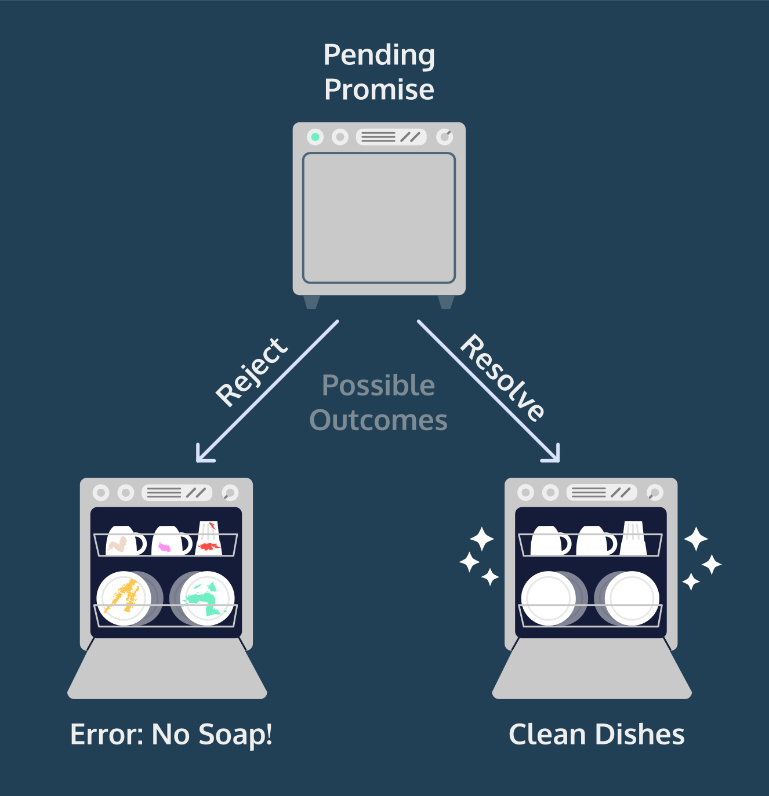

# Intermediate_JavaScript

Continuing to learn some JavaScript.

## Begin Here

[Course on Codecademy](https://www.codecademy.com/enrolled/courses/learn-intermediate-javascript)

[JavaScript Keywords](https://developer.mozilla.org/en-US/docs/Web/JavaScript/Reference/Lexical_grammar#keywords) (Don't use as variable names)

## Vocabulary

> **Classes**  
> JavaScript is an object-oriented programming (OOP) language we can use to model real-world items. Classes are a tool that developers use to quickly produce similar objects.  
___

> **constructor() Method**  
> JavaScript calls the `constructor()` method every time it creates a new _instance_ of a class.  
___

> **Modules**  
> reusable pieces of code in a file that can be exported and then imported for use in another file.
> 

> [!NOTE]  
> The words “module” and “file” are often used interchangably
___

> **Asynchronous Operations**  
> Operations that allow the computer to "move on" to other tasks while waiting for the asynchronous operation to complete.  
> 
___

> **modular program**  
> One whose components can be separated, used individually, and recombined to create a complex system.  
___

> **Promises**  
> Objects that represent the eventual outcome of an asynchronous operation. One can be in three states:  
>
> - Pending: The initial state -- the operation has not completed yet. **Not settled**  
> - Fulfilled: The operation has completed successfully and the promise has now has a _resolved value_. **Settled**  
> - Rejected: The operation has failed and the promise has a reason for the failure. This reason is usually an `Error` of some kind. **Settled**  
>
> 
___

> **.then()**
> This is a method of promises to direct what happens when it's settled, whether `fulfilled` or `rejected`. It takes two arguments, the first is the function to do when fulfilled, called the `onFulfilled` function. The second is the function to do when rejected, called `onRejected`.  
___

> **Composition**  
> The chaining together of multiple promises. For example, "If the clothes are cleaned, then we’ll want to put them in the dryer. After the dryer runs, if the clothes are dry, then we can fold them and put them away."  

> [!NOTE]  
> Promises are designed with composition in mind.
___

> **Promise.all()**  
> Accepts an array of promises as its argument and returns a single promise, which will settle in one of two ways:
>
> - If **all** accepted promises resolve then the new, single promise returns and array of resolve values from each.  
> - If **any** accpeted promise rejects the new, single promise will immediately reject with the reason from the accepted promise's reason. This is known as _failing fast_.
>
___

> **async...await**  
> The `async...await` syntax is [syntactic sugar](https://en.wikipedia.org/wiki/Syntactic_sugar)— it doesn’t introduce new functionality into the language, but rather introduces a new syntax for using promises and generators. Both of these were already built in to the language.  
___

> **wating()**  
> A function that paused a provided function until the first promise resolves to construct a second promise.  
___

> **concurrent()**  
> A function that cunstructs two promises without using `await`. Both are run at the same time.  
___
