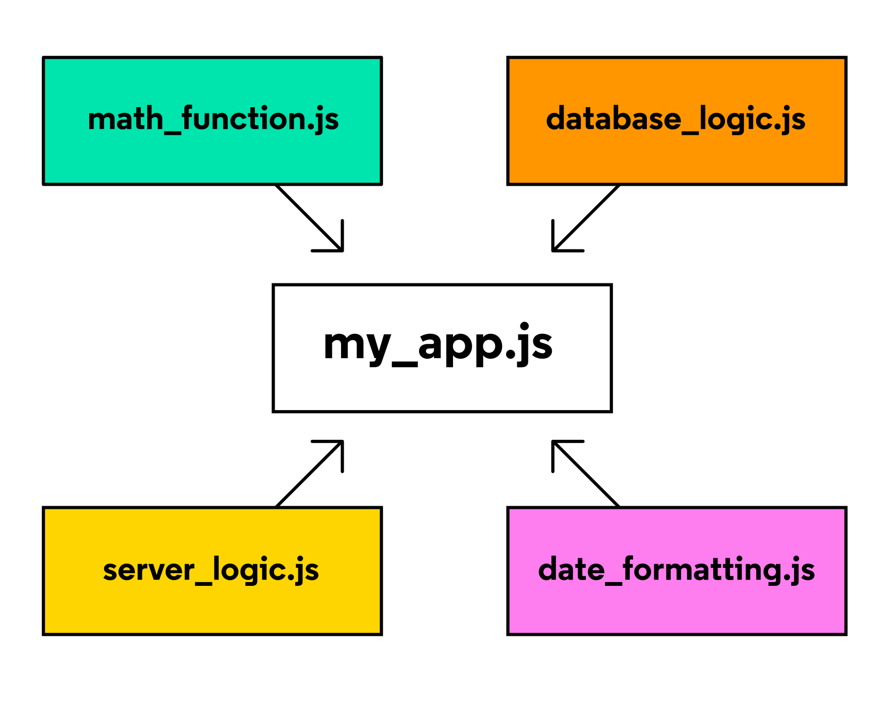

# Intermediate_JavaScript

Continuing to learn some JavaScript.

## Begin Here

[Course on Codecademy](https://www.codecademy.com/enrolled/courses/learn-intermediate-javascript)

[JavaScript Keywords](https://developer.mozilla.org/en-US/docs/Web/JavaScript/Reference/Lexical_grammar#keywords) (Don't use as variable names)

## Vocabulary

> **Classes**  
> JavaScript is an object-oriented programming (OOP) language we can use to model real-world items. Classes are a tool that developers use to quickly produce similar objects.  
___

> **constructor() Method**  
> JavaScript calls the `constructor()` method every time it creates a new _instance_ of a class.  
___

> **Modules**  
> reusable pieces of code in a file that can be exported and then imported for use in another file.
> 

> [!NOTE]  
> The words “module” and “file” are often used interchangably
___

> **Asynchronous Operations**  
> Operations that allow the computer to "move on" to other tasks while waiting for the asynchronous operation to complete.  
> 
___

> **modular program**  
> One whose components can be separated, used individually, and recombined to create a complex system.  
___

> **Promises**  
> Objects that represent the eventual outcome of an asynchronous operation. One can be in three states:  
>
> - Pending: The initial state -- the operation has not completed yet. **Not settled**  
> - Fulfilled: The operation has completed successfully and the promise has now has a _resolved value_. **Settled**  
> - Rejected: The operation has failed and the promise has a reason for the failure. This reason is usually an `Error` of some kind. **Settled**  
>
> 
___
